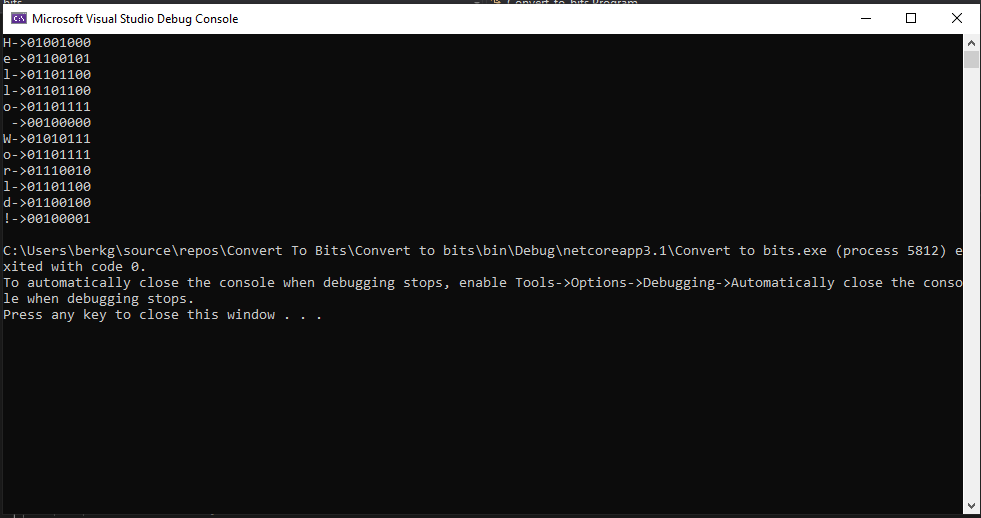

# String ifadeyi bit hale çevirme
## Overview
Bu uygulama string ifadeyi bit hale çevirir.

Bu projede C# kullanmamın sebebi bir sonraki projem içerisinde grafiksel işlemler için kullanacak olmam.
Çünkü bitwise işlemlerinin kullanım alanları şifreleme, sıkıştırma ,grafiksel işlemler gibi alanlardır.

Karılaşılan çok zor bir durum olmadı.
Bu proje'nin asıl yapılma amacı bir sonraki projem olan [message-hide-project](https://github.com/berk420/Message-Hide-Project) için gerekli olan bir kod parçası olmasıdır.

## İçindekiler
Basit bir proje olduğu için bu kısım eklenmemiştir.

## Projeyi kurmak
C# konsolda debug yapabilecek ortamı kurmanız gerekiyor. [buradan](https://www.guru99.com/download-install-visual-studio.html) C#'ı nasıl indirebileceğiniz anlatılmıştır.
Gerekli kütüphaneyi de kodların içerisinde bulunuyor fakat ben buraya da bırakıorum:
```
using System;
```
## Proje kullanımı
Projenin kullanımı oldukça basittir.
```input``` değeri olarak istediğiniz değeri vererek ekranda şu şekilde bir çıktı alacaksınız:


## Credits
Bitwise işlemlerini anlamanıza yardımcı olur: [Bitwise](https://docs.microsoft.com/tr-tr/dotnet/csharp/language-reference/operators/bitwise-and-shift-operators)

## License
Licensed under the [MIT License(LICENSE)


